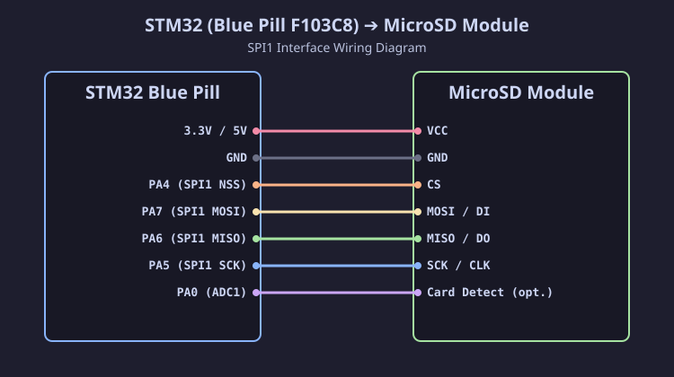

[Читать на русском языке](bluepill_ru.md)

# Connecting SD / MicroSD Module to STM32 (Blue Pill F103C8)

The **STM32F103C8T6 (Blue Pill)** microcontroller operates at a logic level of **3.3 V**, so all SPI1 bus signal lines connect directly to SD / MicroSD cards without voltage dividers or level converters.

## Connection Diagram (SVG)

## Pinout Table

| SD Module Pin | STM32 Blue Pill Pin | STM32 Pin Function | Description |
| :--- | :--- | :--- | :--- |
| **VCC** | **5V** (or 3.3V*) | 5V (USB Power) | Module power (*see note below) |
| **GND** | **GND** | GND | Ground |
| **CS** | **PA4** | **SPI1 NSS** | Chip Select (SS) |
| **SCK** (CLK) | **PA5** | **SPI1 SCK** | Serial Clock |
| **MISO** (DO) | **PA6** | **SPI1 MISO** | Master In Slave Out |
| **MOSI** (DI) | **PA7** | **SPI1 MOSI** | Master Out Slave In |

> [!IMPORTANT]
> **Powering SD Modules from STM32 Blue Pill**:
> - Most cheap SD card modules for Arduino have an onboard linear voltage regulator (AMS1117-3.3).
> - If you supply 3.3 V from the STM32 pin to such a module, the voltage drop across the AMS1117 regulator (~1.1 V) will cause the card power to drop to **2.2 V**, causing **initialization to fail**!
> - Therefore, connect the **VCC pin of ready-made modules to the 5V pin of the STM32 Blue Pill** (USB power).
> - If you are using a bare 3.3V SD slot without an onboard regulator, connect it directly to the STM32 **3.3V** pin.

---

## ⚡ Signal Logic Levels
All SPI1 bus lines (`PA4`, `PA5`, `PA6`, `PA7`) of the STM32F103C8T6 microcontroller output 3.3 V, which 100% matches the SD card specification. No extra resistors or level conversion are required.
