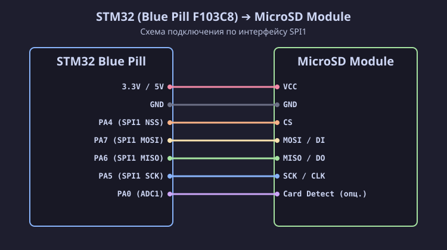

[Read in English](bluepill.md)

# Подключение SD / MicroSD модуля к STM32 (Blue Pill F103C8)

Микроконтроллер **STM32F103C8T6 (Blue Pill)** работает от логического напряжения **3.3 В**, поэтому все сигнальные линии шины SPI1 подключаются к SD / MicroSD картам напрямую без делителей напряжения и конвертеров уровней.

## Схема подключения (SVG)

## Таблица распиновки

| Пин SD модуля | Пин STM32 Blue Pill | Назначение пина STM32 | Описание |
| :--- | :--- | :--- | :--- |
| **VCC** | **5V** (или 3.3V*) | 5V (USB Power) | Питание модуля (*см. примечание ниже) |
| **GND** | **GND** | GND | Общий провод (Земля) |
| **CS** | **PA4** | **SPI1 NSS** | Chip Select (SS) |
| **SCK** (CLK) | **PA5** | **SPI1 SCK** | Serial Clock |
| **MISO** (DO) | **PA6** | **SPI1 MISO** | Master In Slave Out |
| **MOSI** (DI) | **PA7** | **SPI1 MOSI** | Master Out Slave In |

> [!IMPORTANT]
> **Особенности питания SD-модулей от STM32 Blue Pill**:
> - Большинство готовых модулей SD-карт для Arduino имеют на плате встроенный линейный стабилизатор напряжение 3.3 В (AMS1117-3.3).
> - Если подать на такой модуль 3.3 В с пина STM32, то из-за собственного падения напряжения на стабилизаторе AMS1117 (~1.1 В) напряжение питания карты просядет до **2.2 В**, и карта **не сможет инициализироваться**!
> - Поэтому подключайте вывод **VCC готового модуля к пину 5V платы STM32 Blue Pill** (питание от USB).
> - Если вы используете голый 3.3V слот SD без встроенного стабилизатора, подключайте его напрямую к пину **3.3V** STM32.

---

## ⚡ Логические уровни сигналов
Все линии шины SPI1 (`PA4`, `PA5`, `PA6`, `PA7`) микроконтроллера STM32F103C8T6 выдают 3.3 В, что на 100% соответствует спецификации SD-карт. Дополнительные резисторы или согласования не требуются.
