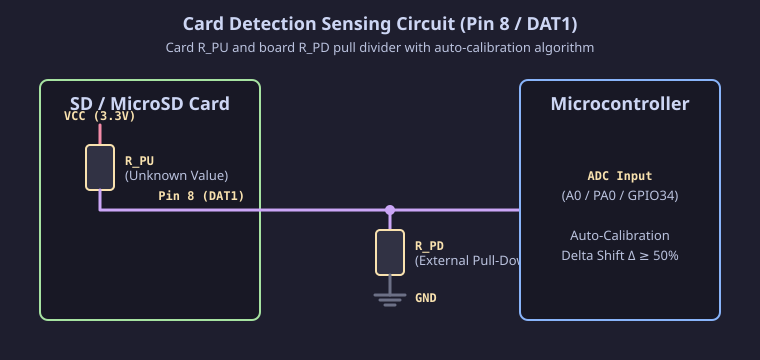

[Читать на русском языке](card_detect_ru.md)

# Hardware Card Detection via DAT1 (Pin 8)

Since most available SD / MicroSD card modules and slots do not feature a dedicated mechanical Card Detect pin, this project uses voltage level sensing on line **DAT1 (Pin 8)** instead.

This document describes the operating principle, circuit diagram, and features of the self-learning card detection algorithm.

> [!NOTE]
> The hardware card detection line is **OPTIONAL**. If the DAT1 line is not connected or a specific card does not produce a voltage shift, the sketch automatically disables the analog detector and falls back to periodic SPI polling.

---

## Technical Features of Line DAT1 (Pin 8)

1. **Non-Standard Method**:
   In the official SD Memory Card specification, pin DAT1 (Pin 8 on full-size SD and MicroSD cards) is intended for data transfer in 4-bit SD Bus mode and **is not an official Card Detect pin**. Connecting the DAT1 line to an analog MCU input is a practical method to detect card insertion without mechanical socket switches.

2. **Uncertainty Across Different Cards**:
   The internal state of the unused DAT1 line in SPI mode is not strictly standardized and depends on the SD card controller manufacturer (SanDisk, Samsung, Kingston, Transcend, generic Chinese cards):
   - **Type A**: controller pulls DAT1 to Ground (0V).
   - **Type B**: controller leaves DAT1 in High-Impedance state (High-Z).
   - **Type C**: controller pulls DAT1 to internal 3.3V power.

---

## Sensing Circuit and Unknown Resistor Values

The detection principle relies on measuring voltage at the midpoint of a voltage divider formed by two resistors:
1. **Internal Card Resistor ($R_{PU}$)** — connected inside the memory card to internal 3.3V power (DAT1 pin). Its value and pull state depend on the card controller manufacturer and are **unknown in advance**.
2. **External Board Pull-Down Resistor ($R_{PD}$)** — connected on the board between the DAT1 line and Ground (GND).

Because resistor values $R_{PU}$ and $R_{PD}$ are not fixed and vary between cards, static voltage calculations are impossible. To solve this problem, the sketch employs a **self-learning auto-calibration algorithm**.

---

## Self-Learning Algorithm (Auto-Calibration)

Due to unknown resistor values and varying behavior across SD card controllers, the program uses dynamic self-learning:

1. **Calibration and Voltage Delta Tracking**:
   On every physical card connection state change, the program measures the voltage level on the analog input and compares it with the previous saved reading. The signal is accepted as a valid insertion step only if the voltage shift is **50% or greater** relative to the maximum level.

2. **Adaptive Level Learning**:
   Upon detecting a voltage shift of 50% or more, the program automatically calibrates: it stores individual voltage levels for "card inserted" and "card removed" states. Subsequently, card presence is monitored by continuously comparing the current voltage with these learned reference values.

3. **Automatic SPI Polling Fallback**:
   If an inserted card does not produce a voltage shift of 50% or more (e.g., leaves the line unpowered or floating), the program deems the analog detector unsuitable, disables it, and transparently switches to periodic SPI polling every 1 second.
