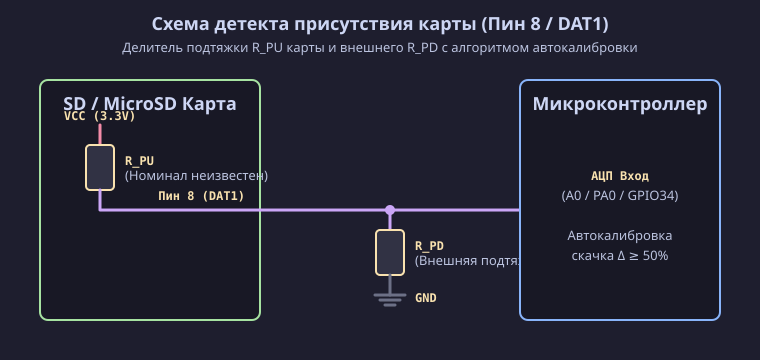

[Read in English](card_detect.md)

# Аппаратное определение присутствия карты по линии DAT1 (Пин 8)

Поскольку большинство доступных модулей и слотов для SD / MicroSD карт не имеют выделенного физического механического контакта присутствия карты (Card Detect), в данном проекте вместо него используется определение наличия карты по изменению напряжения на линии **DAT1 (Пин 8)**.

Данный документ описывает принцип работы, принципиальную схему и особенности самообучающегося алгоритма определения присутствия SD / MicroSD карты.

> [!NOTE]
> Использование линии детекта присутствия карты является **НЕОБЯЗАТЕЛЬНЫМ**. Если линия DAT1 не подключена или конкретная карта не создает скачка напряжения, скетч автоматически отключает аналоговый детектор и переходит на регулярный опрос карты по протоколу SPI.

---

## Технические особенности линии DAT1 (Пин 8)

1. **Нестандартность метода**:
   В официальной спецификации SD Memory Card вывод DAT1 (Пин 8 на полноразмерных SD и MicroSD) предназначен для передачи данных в 4-битом режиме SD Bus и **не является официальным выводом Card Detect**. Подключение линии DAT1 к аналоговому входу микроконтроллера — это практический метод детекта вставки карты без использования механических концевиков слота.

2. **Неопределенность поведения разных карт**:
   Внутреннее состояние неиспользуемой линии DAT1 в режиме SPI не регламентировано строго и зависит от производителя контроллера SD-карты (SanDisk, Samsung, Kingston, Transcend, китайские No-Name):
   - **Тип A**: контроллер притягивает линию DAT1 к Земле (0 В).
   - **Тип B**: контроллер оставляет DAT1 в состоянии высокого импенданса (High-Z).
   - **Тип C**: контроллер подтягивает DAT1 к внутреннему питанию 3.3 В.

---

## Схема детекта и неизвестные номиналы резисторов

Принцип детекта основывается на измерении напряжения в средней точке делителя, образованного двумя резисторами:
1. **Внутренний резистор карты ($R_{PU}$)** — подключен внутри карты памяти к внутреннему питанию 3.3 В (вывод DAT1). Его номинал и состояние зависят от производителя контроллера карты и заранее **неизвестны**.
2. **Внешний резистор подтяжки на плате ($R_{PD}$)** — подключен на плате между линией DAT1 и Землей (GND).

Поскольку номиналы резисторов $R_{PU}$ и $R_{PD}$ заранее не фиксированы и могут отличаться от карты к карте, расчет точных статических напряжений невозможен. Для решения этой проблемы в скетче применяется **алгоритм автоматической калибровки**.

---

## Самообучающийся алгоритм работы (Автокалибровка)

Из-за неизвестных номиналов резисторов и разного поведения контроллеров SD-карт программа использует динамическое самообучение:

1. **Калибровка и отслеживание скачка напряжения**:
   При каждом изменении физического подключения карты программа измеряет уровень напряжения на аналоговом входе и сравнивает его с предыдущим сохраненным значением. Сигнал признается валидным скачком только в том случае, если изменение напряжения составляет **50% или более** от максимального уровня.

2. **Адаптивное запоминание уровней**:
   Зафиксировав скачок напряжения более чем на 50%, программа автоматически калибруется: она запоминает индивидуальные уровни напряжения для текущего состояния «карта вставлена» и состояния «карта извлечена». В дальнейшем определение присутствия карты происходит путем непрерывного сравнения текущего напряжения с этими запомненными значениями.

3. **Автоматическое переключение на опрос по SPI**:
   Если вставленная карта не создает скачка напряжения более 50% (например, оставляет линию незапитанной или уровень не меняется), программа определяет, что аналоговый детектор неприменим, отключает его и прозрачно переходит на регулярную проверку карты по протоколу SPI каждые 1 секунду.
