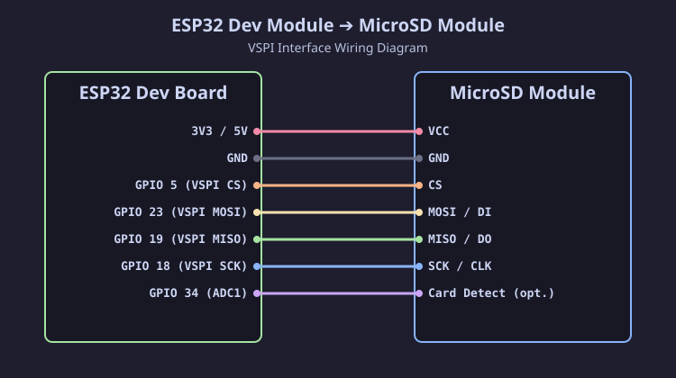

[Читать на русском языке](esp32_ru.md)

# Connecting SD / MicroSD Module to ESP32 (Dev Module)

The ESP32 microcontroller operates at a logic level of **3.3 V**, so VSPI bus signal lines connect directly to SD / MicroSD cards without voltage dividers or level converters. All card form factors (Full-size SD, MiniSD, MicroSD) are supported.

## Connection Diagram (SVG)

## Pinout Table

| MicroSD Module Pin | ESP32 DevKit Pin | Description |
| :--- | :--- | :--- |
| **VCC** | **3V3** / **5V** | Module power |
| **GND** | **GND** | Ground |
| **CS** | **GPIO 5** | VSPI Chip Select (SS) |
| **MOSI** (DI) | **GPIO 23** | VSPI MOSI |
| **MISO** (DO) | **GPIO 19** | VSPI MISO |
| **SCK** (CLK) | **GPIO 18** | VSPI SCK |
