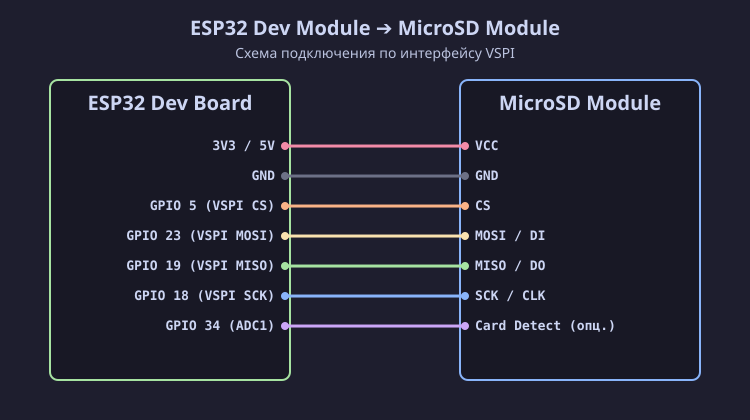

[Read in English](esp32.md)

# Подключение SD / MicroSD модуля к ESP32 (Dev Module)

Микроконтроллер ESP32 работает от логического напряжения **3.3 В**, поэтому сигнальные линии шины VSPI подключаются к SD / MicroSD картам напрямую без делителей напряжения и конвертеров уровней. Поддерживаются карты всех форм-фактора (полноразмерные SD, MiniSD, MicroSD).

## Схема подключения (SVG)

## Таблица распиновки

| Пин MicroSD модуля | Пин ESP32 DevKit | Описание |
| :--- | :--- | :--- |
| **VCC** | **3V3** / **5V** | Питание модуля |
| **GND** | **GND** | Общий провод (Земля) |
| **CS** | **GPIO 5** | VSPI Chip Select (SS) |
| **MOSI** (DI) | **GPIO 23** | VSPI MOSI |
| **MISO** (DO) | **GPIO 19** | VSPI MISO |
| **SCK** (CLK) | **GPIO 18** | VSPI SCK |
