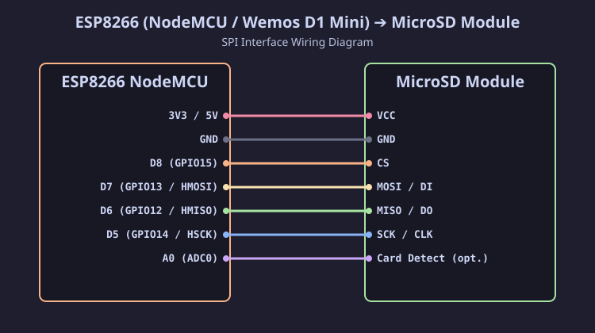

[Читать на русском языке](esp8266_ru.md)

# Connecting SD / MicroSD Module to ESP8266 (NodeMCU / Wemos D1 Mini)

The ESP8266 microcontroller operates at a logic level of **3.3 V**, so SPI interface lines (`D5`, `D6`, `D7`, `D8`) connect to the SD / MicroSD module directly without voltage dividers or level converters. All form factors (Full-size SD, MiniSD, MicroSD) are supported.

## Connection Diagram (SVG)

## Pinout Table

| MicroSD Module Pin | NodeMCU Pin | ESP8266 GPIO | Description |
| :--- | :--- | :--- | :--- |
| **VCC** | **3V3** / **VV** (5V) | — | Power (3.3V direct or 5V via module LDO) |
| **GND** | **GND** | GND | Ground |
| **CS** | **D8** | **GPIO15** | Hardware CS (SS) |
| **MOSI** (DI) | **D7** | **GPIO13** | HMOSI |
| **MISO** (DO) | **D6** | **GPIO12** | HMISO |
| **SCK** (CLK) | **D5** | **GPIO14** | HSCK |

> [!IMPORTANT]
> Pin **D8 (GPIO15)** must be pulled LOW to GND during boot for the ESP8266 to start up successfully. Standard SD card modules usually do not interfere with boot, but if you encounter boot issues, ensure there are no extra pull-up resistors to 3.3V on the CS pin.
