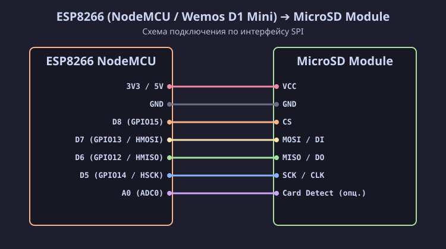

[Read in English](esp8266.md)

# Подключение SD / MicroSD модуля к ESP8266 (NodeMCU / Wemos D1 Mini)

Микроконтроллер ESP8266 работает от логического напряжения **3.3 В**, поэтому линии интерфейса SPI (`D5`, `D6`, `D7`, `D8`) подключаются к SD / MicroSD модулю напрямую без использования делителей напряжения или конвертеров уровней. Поддерживаются карты любого форм-фактора (полноразмерные SD, MiniSD, MicroSD).

## Схема подключения (SVG)

## Таблица распиновки

| Пин MicroSD модуля | Пин NodeMCU | GPIO ESP8266 | Описание |
| :--- | :--- | :--- | :--- |
| **VCC** | **3V3** / **VV** (5V) | — | Питание (3.3 В напрямую или 5 В через LDO модуля) |
| **GND** | **GND** | GND | Общий провод (Земля) |
| **CS** | **D8** | **GPIO15** | Hardware CS (SS) |
| **MOSI** (DI) | **D7** | **GPIO13** | HMOSI |
| **MISO** (DO) | **D6** | **GPIO12** | HMISO |
| **SCK** (CLK) | **D5** | **GPIO14** | HSCK |

> [!IMPORTANT]
> Пин **D8 (GPIO15)** должен быть притянут к GND при старте ESP8266 для успешной загрузки микроконтроллера. Обычно модуль SD-карты не мешает загрузке, но при возникновении проблем убедитесь в отсутствии лишних подтяжек к 3.3 В на пине CS.
