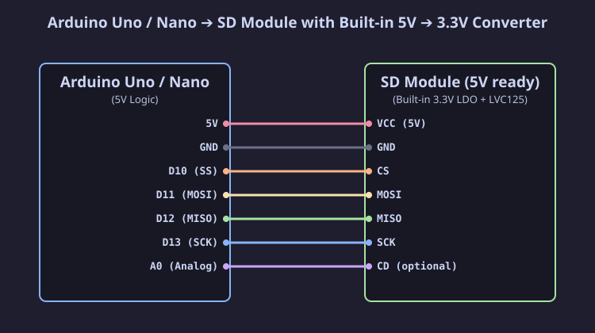
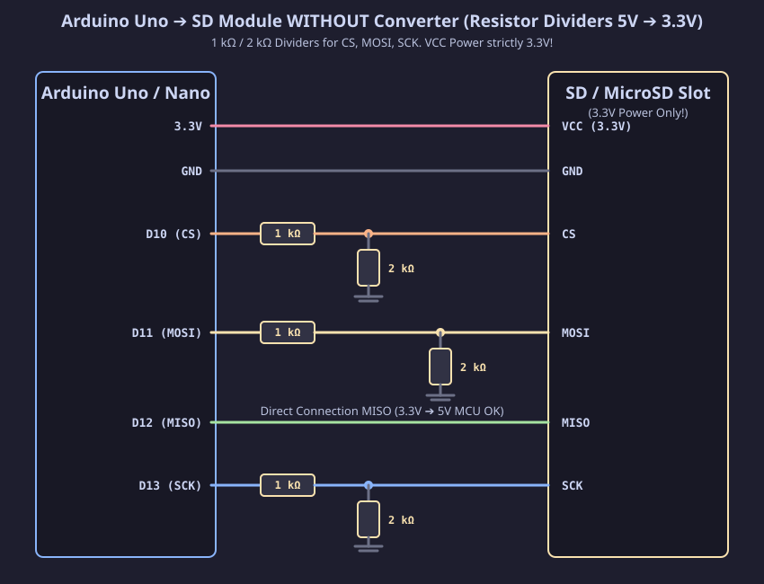
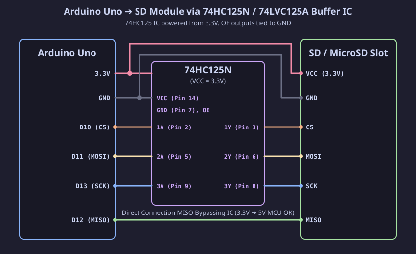

[Читать на русском языке](uno_ru.md)

# Connecting SD / MicroSD Module to Arduino Uno / Nano / Mega

The Arduino Uno / Nano board operates at a logic level of **5 V**, whereas SD / MicroSD memory cards of all form factors (Full-size SD, MiniSD, MicroSD) operate strictly at voltages from **2.7 V to 3.6 V (nominally 3.3 V)**.

Below are detailed connection options for SD / MicroSD card modules depending on their design.

---

## Option 1: SD Module with Built-in Level Converter (5V Ready)

Most ready-made modules for Arduino (red or blue boards with an SD / MicroSD slot) already contain an onboard 3.3 V voltage regulator (AMS1117-3.3) and a logic level converter chip (74LVC125A).

### Pinout Table (Option 1)

| SD Module Pin | Arduino Uno / Nano Pin | Arduino Mega 2560 Pin | Description |
| :--- | :--- | :--- | :--- |
| **VCC** | **5V** | **5V** | Module 5V power |
| **GND** | **GND** | **GND** | Ground |
| **CS** | **D10** (SS) | **D53** / **D10** | Chip Select |
| **MOSI** (DI) | **D11** | **D51** | Master Out Slave In |
| **MISO** (DO) | **D12** | **D50** | Master In Slave Out |
| **SCK** (CLK) | **D13** | **D52** | Serial Clock |

---

## Option 2: Bare SD / MicroSD Slot (Without 3.3V Level Converter)

If you are using a bare SD / MicroSD slot or a module without a level matching IC, **do not connect 5V signal lines from Arduino directly to the card**, as this will permanently damage the SD card.

### Option 2.1: Level Matching Using Resistor Voltage Dividers

The simplest and most accessible way to lower 5 V signals to a safe 3.3 V level for control lines `CS`, `MOSI`, and `SCK` is using resistor dividers.

#### Resistor Divider Calculation:
Voltage divider output formula:
$$V_{OUT} = V_{IN} \times \frac{R_2}{R_1 + R_2}$$

For $V_{IN} = 5.0\text{ V}$, $R_1 = 1.0\text{ k}\Omega$, $R_2 = 2.0\text{ k}\Omega$:
$$V_{OUT} = 5.0 \times \frac{2000}{1000 + 2000} \approx 3.33\text{ V}$$

> [!IMPORTANT]
> The **MISO** line goes from the SD card to the Arduino. The card outputs a 3.3 V signal. For the ATmega328P microcontroller, the minimum high logic level threshold is $V_{IH\_MIN} = 0.6 \times V_{CC} = 3.0\text{ V}$. For this reason, the **MISO line connects directly without a divider**!

---

### Option 2.2: Level Matching via 74HC125N / 74LVC125A Buffer IC

For higher speed and more reliable data transmission, it is recommended to use a **74HC125N** (or 74LVC125A) quad bus buffer chip instead of resistors.

#### Wiring the 74HC125N Chip:
1. Chip power **VCC (Pin 14)** connects to Arduino **3.3V**, and **GND (Pin 7)** connects to **GND**.
2. Output enable inputs **1OE, 2OE, 3OE, 4OE** connect to **GND**.
3. 5V signals from Arduino connect to `A` inputs:
   - Arduino `D10 (CS)` ➔ Pin 2 (`1A`) ➔ Output `1Y` (Pin 3) ➔ SD `CS` (3.3V)
   - Arduino `D11 (MOSI)` ➔ Pin 5 (`2A`) ➔ Output `2Y` (Pin 6) ➔ SD `MOSI` (3.3V)
   - Arduino `D13 (SCK)` ➔ Pin 9 (`3A`) ➔ Output `3Y` (Pin 8) ➔ SD `SCK` (3.3V)
4. SD line `MISO` (3.3V) connects directly to Arduino `D12`.
