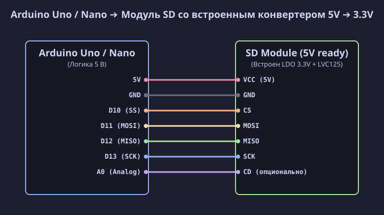
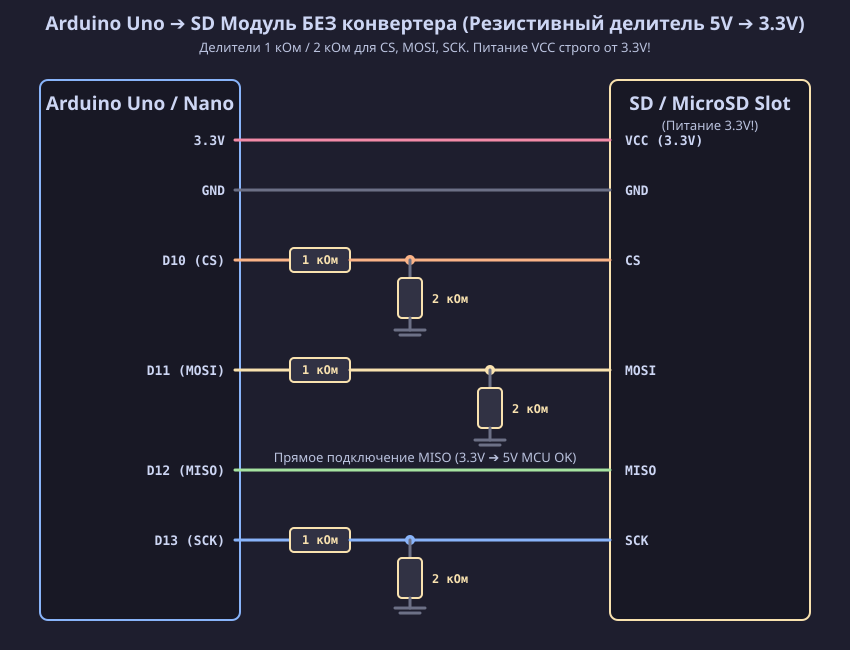
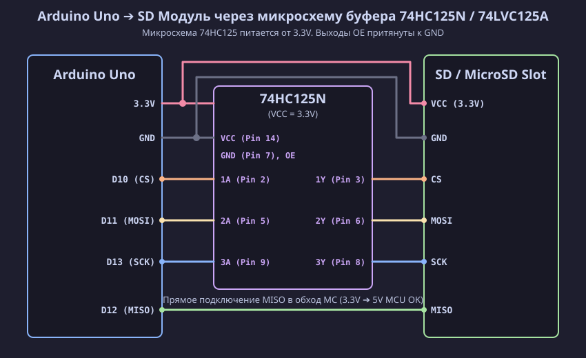

[Read in English](uno.md)

# Подключение SD / MicroSD модуля к Arduino Uno / Nano / Mega

Плата Arduino Uno / Nano работает от логического напряжения **5 В**, в то время как карты памяти SD / MicroSD любого форм-фактора (полноразмерные SD, MiniSD, MicroSD) работают строго от напряжений **2.7 В – 3.6 В (номинально 3.3 В)**. 

Ниже подробно описаны все варианты подключения модулей SD / MicroSD карт в зависимости от их конструкции.

---

## Вариант 1: Модуль SD со встроенным конвертером уровней (5V Ready)

Большинство готовых модулей для Arduino (красные или синие платы со слотом SD / MicroSD) уже содержат на плате понижающий стабилизатор напряжения 3.3 В (AMS1117-3.3) и микросхему конвертера логических уровней (74LVC125A).

### Таблица подключения (Вариант 1)

| Пин SD модуля | Пин Arduino Uno / Nano | Пин Arduino Mega 2560 | Описание |
| :--- | :--- | :--- | :--- |
| **VCC** | **5V** | **5V** | Питание модуля 5 В |
| **GND** | **GND** | **GND** | Общий провод (Земля) |
| **CS** | **D10** (SS) | **D53** / **D10** | Chip Select |
| **MOSI** (DI) | **D11** | **D51** | Master Out Slave In |
| **MISO** (DO) | **D12** | **D50** | Master In Slave Out |
| **SCK** (CLK) | **D13** | **D52** | Serial Clock |

---

## Вариант 2: Голый слот SD / MicroSD (без конвертера уровней 3.3В)

Если вы используете голый слот SD / MicroSD или модуль без микросхемы согласования уровней, **нельзя подключать линии 5В от Arduino напрямую к карте**, так как это приведет к выходу SD-карты из строя.

### Вариант 2.1: Согласование на резистивных делителях напряжения

Самый простой и доступный способ понизить сигналы 5 В до безопасных 3.3 В для управляющих линий `CS`, `MOSI` и `SCK` — использовать резистивные делители.

#### Расчет резистивного делителя:
Формула вычисления выходного напряжения делителя:
$$V_{OUT} = V_{IN} \times \frac{R_2}{R_1 + R_2}$$

При $V_{IN} = 5.0\text{ В}$, $R_1 = 1.0\text{ кОм}$, $R_2 = 2.0\text{ кОм}$:
$$V_{OUT} = 5.0 \times \frac{2000}{1000 + 2000} \approx 3.33\text{ В}$$

> [!IMPORTANT]
> Линия **MISO** идет от SD-карты к Arduino. Карта выдает сигнал 3.3 В. Для микроконтроллера ATmega328P минимальный уровень логической единицы равен $V_{IH\_MIN} = 0.6 \times V_{CC} = 3.0\text{ В}$. По этой причине линия **MISO подключается напрямую без делителя**!

---

### Вариант 2.2: Согласование на микросхеме буфера 74HC125N / 74LVC125A

Для более высокоскоростной и надежной передачи данных вместо резисторов рекомендуется использовать микросхему шинного буфера **74HC125N** (или 74LVC125A).

#### Подключение микросхемы 74HC125N:
1. Питание микросхемы **VCC (пин 14)** подключается к **3.3V** Arduino, а **GND (пин 7)** — к **GND**.
2. Разрешающие входы **1OE, 2OE, 3OE, 4OE** соединяются с **GND**.
3. Сигналы от Arduino 5V подаются на входы `A`:
   - Arduino `D10 (CS)` ➔ Пин 2 (`1A`) ➔ Выход `1Y` (Пин 3) ➔ SD `CS` (3.3V)
   - Arduino `D11 (MOSI)` ➔ Пин 5 (`2A`) ➔ Выход `2Y` (Пин 6) ➔ SD `MOSI` (3.3V)
   - Arduino `D13 (SCK)` ➔ Пин 9 (`3A`) ➔ Выход `3Y` (Пин 8) ➔ SD `SCK` (3.3V)
4. Линия SD `MISO` (3.3V) подключается напрямую к Arduino `D12`.
